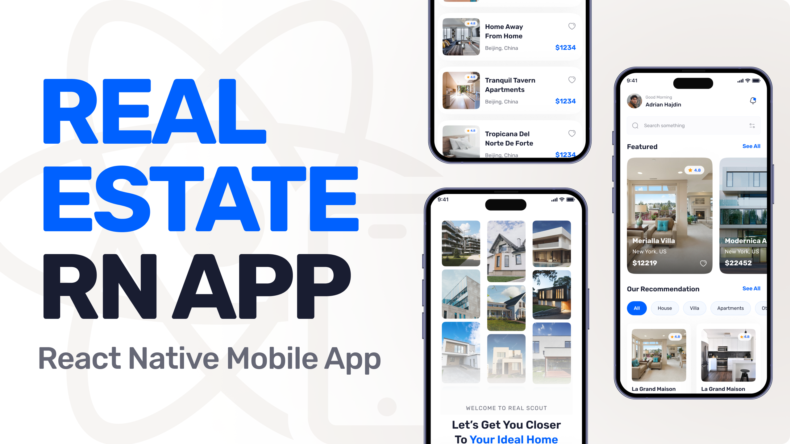

   
   
   
   
   

   <h2>A Real Estate App</h2>

## Introduction
Build a full-stack Real Estate application with React Native, featuring Google authentication, dynamic property listings, and user profiles.
Designed with modern tools like Expo SDK 53, Appwrite, Tailwind CSS, and TypeScript for a seamless and scalable experience.

## Tech Stack
- Expo
- React Native
- TypeScript
- Nativewind
- Appwrite
- Tailwind CSS

## Features
- **Authentication with Google**: Secure and seamless user sign-ins using Google's authentication service.
- **Home Page**: Display the latest and recommended properties with powerful search and filter functionality.  
- **Explore Page**: Allows users to browse all types of properties with a clean and intuitive interface.
- **Property Details Page**: Provides comprehensive information about individual properties, including images and key details.
- **Profile Page**: Customizable user settings and profile management. 
- **Centralized Data Fetching**: Custom-built solution inspired by TanStack's useQuery for efficient API calls.

and many more, including code architecture and reusability.

## Quick Start
Follow these steps to set up the project locally on your machine.

**Prerequisites**

Make sure you have the following installed on your machine:
- [Git](https://git-scm.com/)
- [Node.js](https://nodejs.org/en)
- [npm](https://www.npmjs.com/)(Node Package Manager)

**Cloning the Repository**